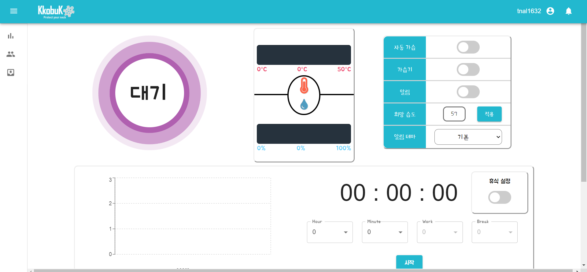

# :rocket: KkobuK
현대인들의 대표 고질병으로 꼽히는 거북목은 **자세의 나쁨을 인지하지 못한다**는 것에 있습니다.
저희 꼬북목이 여러분의 목을 지켜드릴 것입니다.


## :scream: Introduce

## Announcements

Release 1.9 사용 가능합니다.


## Deployment
```
https://i3b109.p.ssafy.io
kkobuk.tk
```




## Contributor
- [김호준](https://lab.ssafy.com/bright327) @bright327
- [박인남](https://lab.ssafy.com/pin954562) @pin954562
- [박주현](https://lab.ssafy.com/james5450) @james5450
- [심동식](https://lab.ssafy.com/tlaehdtlr7) @tlaehdtlr7
- [조수미](https://lab.ssafy.com/tnal1632) @tnal1632


## :lock: License
이 프로젝트의 라이센스는 챌린저 팀 소유입니다.


## Description

- IoT/
  - 라즈베리파이, 아두이노
- backend/
  - Django-rest-framework
- frontend/
  - React